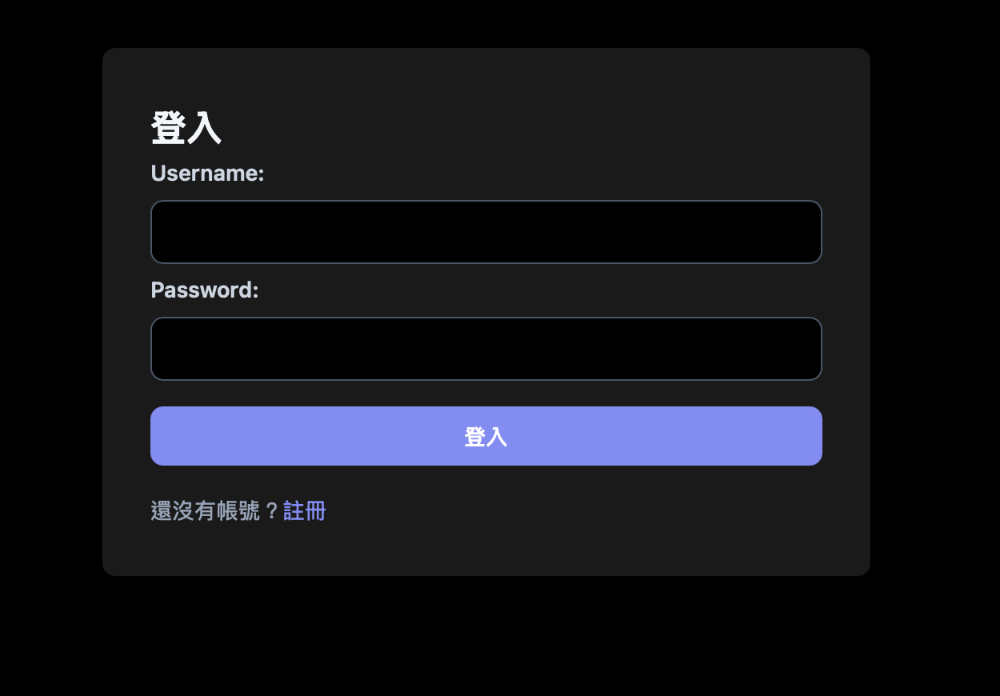
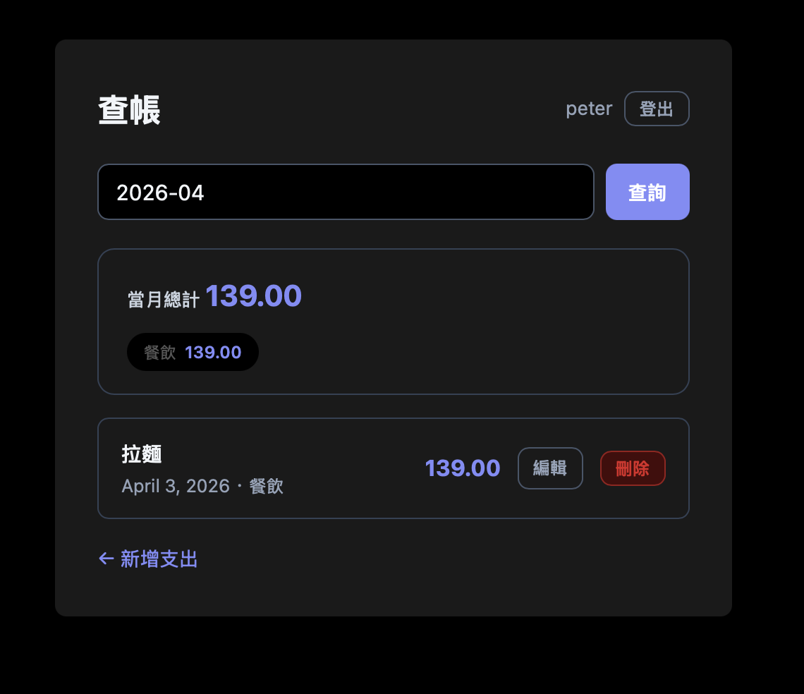
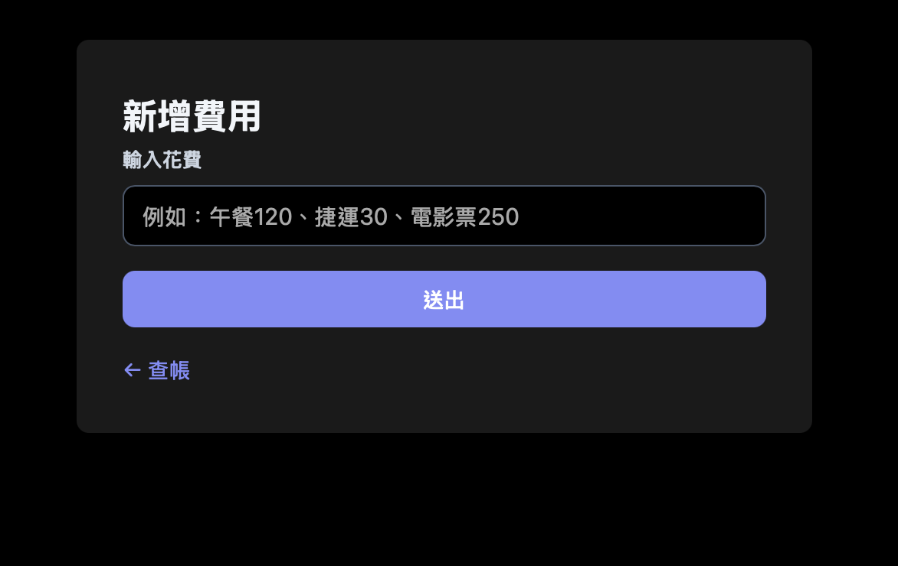
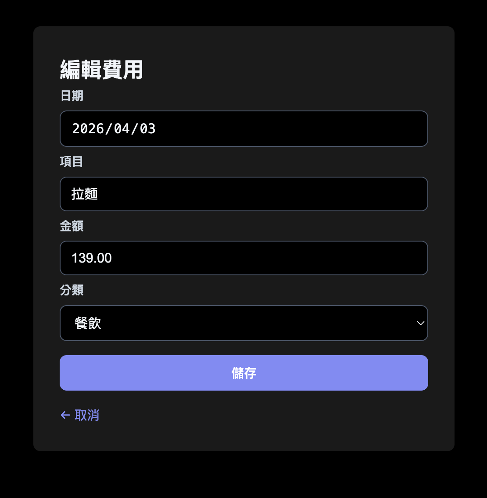

# 💰 AI 記帳本

一個結合 AI 自然語言輸入的 Django 記帳 Web App，部署於 Render，資料庫使用 Supabase PostgreSQL。

🔗 **Demo：** [https://dj-104t.onrender.com](https://dj-104t.onrender.com)

---

## 📸 截圖






---

## ✨ 功能介紹

- **AI 自然語言記帳** — 輸入「午餐120、捷運30」，AI 自動解析金額、分類、日期
- **手動編輯** — 可修改日期、項目、金額、分類四個欄位
- **月份篩選** — 按月查看支出清單與總計
- **分類小計** — 自動彙整餐飲、交通、娛樂、生活、其他各類支出
- **帳號系統** — 支援註冊／登入／登出，資料依使用者隔離
- **深色模式** — 自動跟隨系統設定

---

## 🛠 技術架構

| 層級 | 技術 |
|------|------|
| 後端框架 | Django 6 |
| 資料庫 | Supabase（PostgreSQL） |
| AI 解析 | Google Gemini API（Gemma 3 27B） |
| 靜態檔案 | WhiteNoise |
| 部署 | Render |
| 環境變數 | django-environ |

---

## 🚀 本地安裝步驟

**1. Clone 專案**
```bash
git clone https://github.com/你的帳號/你的repo名稱.git
cd 你的repo名稱
```

**2. 建立虛擬環境並安裝套件**
```bash
python3 -m venv venv
source venv/bin/activate
pip install -r requirements.txt
```

**3. 建立 `.env` 檔**
```
SECRET_KEY=你的Django金鑰
DATABASE_URL=你的Supabase連線字串
GEMINI_API_KEY=你的Gemini金鑰
DEBUG=True
```

**4. 執行 migration 並建立管理員**
```bash
python manage.py migrate
python manage.py createsuperuser
```

**5. 啟動開發伺服器**
```bash
python manage.py runserver
```

打開 [http://127.0.0.1:8000](http://127.0.0.1:8000) 即可使用。